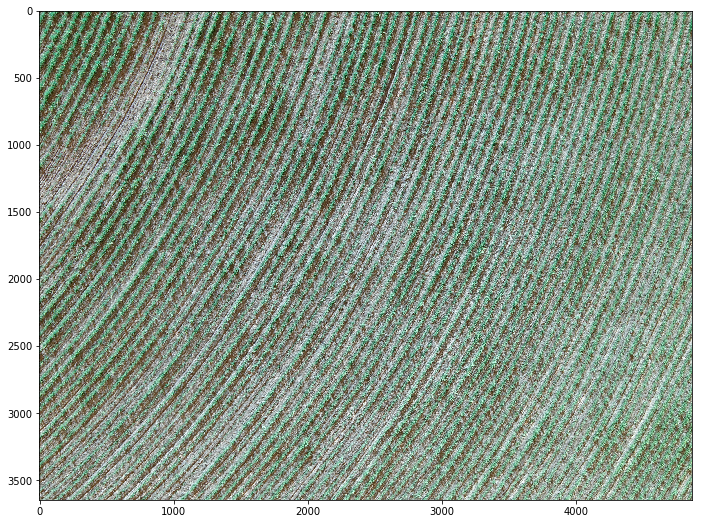
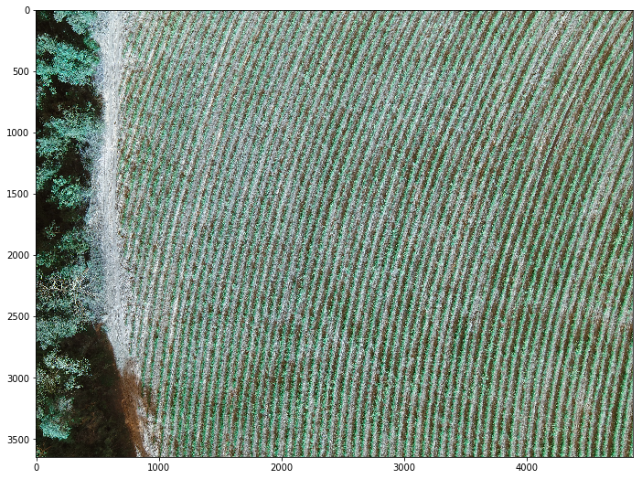
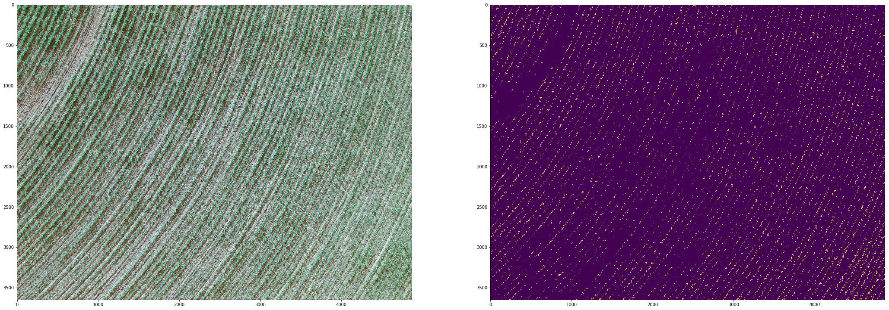
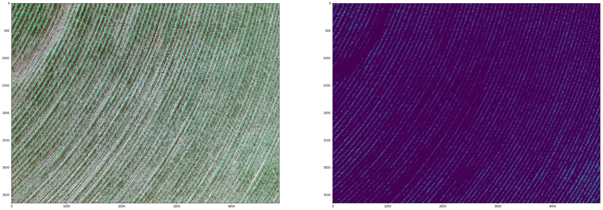
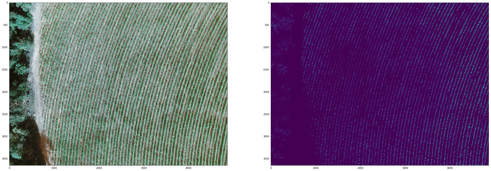
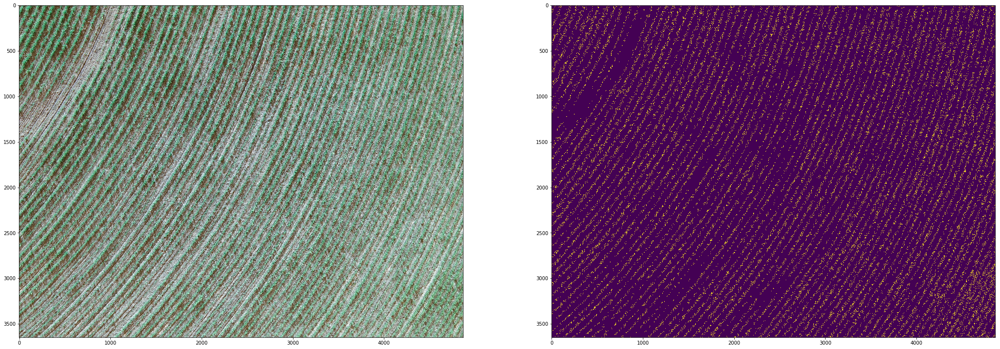
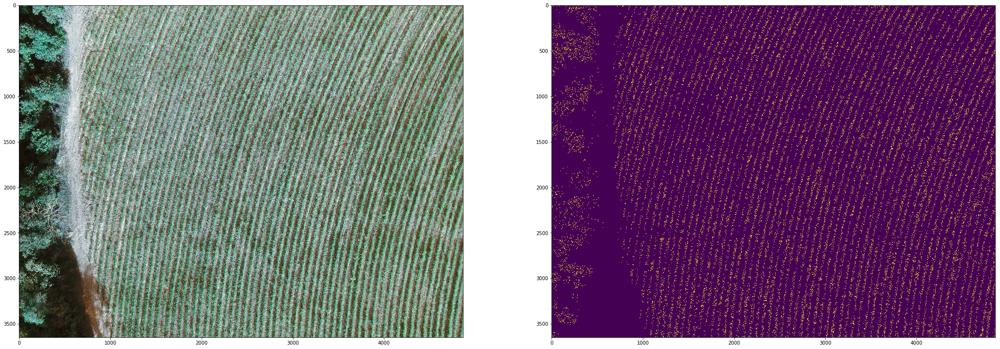

# Identificação e Mapeamento autônomo de linhas e falhas de Cana de Açúcar

Neste trabalho é proposto um algoritmo para a detecção e mapeamento de linhas e falhas na cultura da cana de açúcar. O sistema de visão computacional foi desenhado para utilizar imagens áreas provenientes de sensores acoplados a sistemas embarcados. O algoritmo é constituído de duas etapas, a de pré processamento, em que são eliminados ruídos e evidenciados os objetos de interesse. Na segunda etapa são aplicados os filtros de Canny, para a detecção de bordas e, posteriormente, o algoritmo de Suzuki para a detecção de contornos.


## Introdução

    - O indice de falhas na cultura da cana de açúcar é um importante indicador da qualidade do canavial.
    - O georeferenciamento das linhas de plantio são impressindíveis para sistemas de agricultura de precisão.

## Objetivos
    
    - Identificar falhas.
    - Georeferênciar linhas da cultura.
    - Contar touceiras.

## Instalação

Para utilizar este projeto é necessário fazer o download do mesmo [neste](https://github.com/joaoTrevizoli/python_agriculture_cv) repositório.

Para instalar, abra o terminal e digite:

```sh
$ cd python_agriculture_cv
$ pip install -r requirements.txt
```

Para testar o exemplo e ver se o package está funcionando digite:

```sh
$ python main.py
```

Para utilizar o interativo jupyter notebook digite

```sh
$ jupyter notebook
```


```python
%matplotlib inline
from sugarcane_line_finder import *
from matplotlib import pyplot as plt

import os
import sys
import cv2
import re

b_path = base_path()
images = os.listdir("{}/{}".format(b_path, "base_images"))
images
```


    ['.DS_Store',
     'cana_01.jpg',
     'cana_02.jpg',
     'DSC00676.jpg',
     'DSC00677.JPG',
     'DSC00678.JPG',
     'DSC00679.JPG',
     'DSC00681.JPG']


```python
allowed_extensions = ("jpg", "JPG", "png", "img", "gif", "bmp")

pattern = re.compile("(cana)")

image_path = ["{}/base_images/{}".format(b_path, i) for i in images if i.split(".")[1] in allowed_extensions and pattern.search(i)]
image_names = [i for i in images if i.split(".")[1] in allowed_extensions and pattern.search(i)]
image_names
```


    ['cana_01.jpg', 'cana_02.jpg']


```python
image_path
```


    ['/Users/joaotrevizoliesteves/projects/python_agriculture_cv/base_images/cana_01.jpg',
     '/Users/joaotrevizoliesteves/projects/python_agriculture_cv/base_images/cana_02.jpg']


```python
sugarcane_images = []
for i in zip(image_path, image_names):
        img = cv2.imread(i[0])
        image_dict = {"img": img,
                      "name": i[1]}
        sugarcane_images.append(image_dict)
        plt.figure(figsize=(16, 9))
        plt.imshow(img)
        plt.show()    
```








```python
for i in sugarcane_images:
    print(i["img"].shape)
```

    (3648, 4864, 3)
    (3648, 4864, 3)


```python
print("Vamos processar multiplas imagens através de um gerador")
pre_processors = SugarCanePreProcessing.multiple_processor(sugarcane_images, True)
print("Generator: ",pre_processors)
for i, j in zip(pre_processors, sugarcane_images):
    j["pre_processor"] = i
    print("generated object: ", i)

```

    Vamos processar multiplas imagens através de um gerador
    Generator:  <generator object SugarCanePreProcessing.multiple_processor at 0x109df8d58>
    generated object:  <sugarcane_line_finder.SugarCanePreProcessing object at 0x1097a86d8>
    generated object:  <sugarcane_line_finder.SugarCanePreProcessing object at 0x1097a2cf8>


```python
sugarcane_images
```


    [{'img': array([[[ 88,  68,  51],
              [ 97,  76,  61],
              [ 96,  78,  67],
              ..., 
              [210, 213, 204],
              [210, 213, 204],
              [194, 197, 188]],
      
             [[ 84,  62,  44],
              [ 93,  72,  57],
              [ 91,  74,  61],
              ..., 
              [206, 209, 200],
              [192, 195, 186],
              [173, 176, 167]],
      
             [[ 85,  63,  45],
              [ 92,  72,  55],
              [ 90,  71,  58],
              ..., 
              [195, 200, 191],
              [170, 174, 168],
              [153, 157, 151]],
      
             ..., 
             [[164, 177, 161],
              [168, 179, 163],
              [177, 184, 169],
              ..., 
              [140, 139, 119],
              [133, 131, 113],
              [147, 147, 129]],
      
             [[190, 205, 191],
              [185, 198, 184],
              [175, 184, 171],
              ..., 
              [125, 125, 107],
              [121, 121, 103],
              [135, 137, 118]],
      
             [[204, 219, 205],
              [192, 205, 191],
              [172, 181, 168],
              ..., 
              [110, 110,  92],
              [103, 104,  88],
              [116, 117, 101]]], dtype=uint8),
      'name': 'cana_01.jpg',
      'pre_processor': <sugarcane_line_finder.SugarCanePreProcessing at 0x1097a86d8>},
     {'img': array([[[ 28,  26,  26],
              [ 22,  19,  15],
              [ 26,  21,  12],
              ..., 
              [192, 182, 164],
              [175, 166, 146],
              [149, 138, 118]],
      
             [[ 25,  23,  22],
              [ 22,  19,  14],
              [ 23,  21,  11],
              ..., 
              [172, 163, 143],
              [147, 136, 116],
              [123, 112,  92]],
      
             [[ 23,  22,  18],
              [ 21,  18,  13],
              [ 23,  21,  11],
              ..., 
              [142, 128, 109],
              [112,  99,  77],
              [ 99,  85,  63]],
      
             ..., 
             [[ 10,  16,   5],
              [  2,   7,   0],
              [  0,   4,   0],
              ..., 
              [214, 223, 210],
              [210, 216, 205],
              [214, 220, 209]],
      
             [[ 13,  23,  11],
              [  6,  14,   3],
              [  5,  15,   3],
              ..., 
              [206, 215, 202],
              [203, 209, 198],
              [202, 208, 197]],
      
             [[  6,  18,   6],
              [  9,  19,   7],
              [ 18,  28,  16],
              ..., 
              [179, 186, 173],
              [171, 177, 166],
              [165, 171, 160]]], dtype=uint8),
      'name': 'cana_02.jpg',
      'pre_processor': <sugarcane_line_finder.SugarCanePreProcessing at 0x1097a2cf8>}]


```python
print("Segmentar a imagem tentado separar o que é fundo do que é cana de açúcar")
for i in sugarcane_images:
    plt.figure(figsize=(36, 18))
    i["green_filtered"] = i["pre_processor"].select_rgb_green()
    plt.subplot(1, 2, 1)
    plt.imshow(i["img"])
    plt.subplot(1, 2, 2)
    plt.imshow(i["green_filtered"])
    plt.show()

```

    Segmentar a imagem tentado separar o que é fundo do que é cana de açúcar


```python
print("Erosão seguida de dilatação")
for i in sugarcane_images:
    i["erode_dilation"] = i["pre_processor"].morphological_transformation(i["green_filtered"], 1, 1, cv2.erode)
    i["erode_dilation"] = i["pre_processor"].morphological_transformation(i["erode_dilation"], 1, 1, cv2.erode)
    plt.figure(figsize=(36, 18))
    plt.subplot(1, 2, 1)
    plt.imshow(i["img"])
    plt.subplot(1, 2, 2)
    plt.imshow(i["erode_dilation"])
    plt.show()
```

    Erosão seguida de dilatação





```python
print("Suavização Gaussiana")

for i in sugarcane_images:
    i["gauss_smooth"] = i["pre_processor"].gaussian_smooth(i["erode_dilation"])
    plt.figure(figsize=(36, 18))
    plt.subplot(1, 2, 1)
    plt.imshow(i["img"])
    plt.subplot(1, 2, 2)
    plt.imshow(i["gauss_smooth"])
    plt.show()
```

    Suavização Gaussiana








```python
print("Instancias objetos que procuram bordas pelo metodo de canny")

```

    Instancias objetos que procuram bordas pelo metodo de canny


```python
for i in sugarcane_images:
    i["sugarcane_line_finder"] = SugarCaneLineFinder(i["gauss_smooth"], i["name"], True)
    i["edges"] = i["sugarcane_line_finder"].canny()
    plt.figure(figsize=(36, 18))
    plt.subplot(1, 2, 1)
    plt.imshow(i["img"])
    plt.subplot(1, 2, 2)
    plt.imshow(i["edges"])
    plt.show()
```








```python
for i in sugarcane_images:
    image = i["img"].copy()
    i["sugarcane_line_finder"].get_lines(image)
    i["countours"] = image
    print(i["sugarcane_line_finder"])
    plt.figure(figsize=(16, 9))
    plt.imshow(i["countours"])
    plt.show()  


```

## Conclusão

- Foi Possível segmentar a cultura da cana de açúcar.
- Os método de  Canny (1986) e Suzuki et al. (1985) foram capazes de identificar as linhas e falhas na cultura.
- Foi possível identificar e contar o numero de touceiras de cana.
- É necessário dar procedimento nos estudos.

## Bibliografia

AZEVEDO, E.; CONCI, A. Computação gráfica: teoria e prática. [S.l.]: Elsevier, 2003.<br/>
BROSNAN, T.; SUN, D.-W. Improving quality inspection of food products by computer vision—-a review. Journal of food engineering, Elsevier, v. 61, n. 1, p. 3–16, 2004.<br/>
BRUCE, J.; BALCH, T.; VELOSO, M. Fast and inexpensive color image segmentation for interactive robots. In: IEEE. Intelligent Robots and Systems, 2000.(IROS 2000). Proceedings. 2000 IEEE/RSJ International Conference on. [S.l.], 2000. v. 3, p. 2061–2066.<br/>
CANNY, J. A computational approach to edge detection. IEEE Transactions on pattern analysis and machine intelligence, Ieee, n. 6, p. 679–698, 1986.<br/>
DAVIS, G.; CASADY, W. W.; MASSEY, R. E. Precision agriculture: An introduction. Extension publications (MU), University of Missouri Extension, 1998.<br/>
GLASBEY, C. A.; HORGAN, G. W. Image analysis for the biological sciences. [S.l.]: Wiley Chichester, 1995. v. 1.<br/>
PHADIKAR, S.; SIL, J. Rice disease identification using pattern recognition techniques. In: IEEE. Computer and Information Technology, 2008. ICCIT 2008. 11th International Conference on. [S.l.], 2008. p. 420–423.<br/>
SOILLE, P. Morphological image analysis: principles and applications. [S.l.]: Springer Science & Business Media, 2013.<br/>
SUZUKI, S. et al. Topological structural analysis of digitized binary images by border following. Computer vision, graphics, and image processing, Elsevier, v. 30, n. 1, p. 32–46, 1985.<br/>
YAN’E, Z. et al. Nutrition information extraction of the cucumber leaves in the greenhouse based on computer vision technology [j]. Transactions of The Chinese Society of Agricultural Engineering, v. 8, p. 022, 2005.<br/>


```python

```


```python

```
